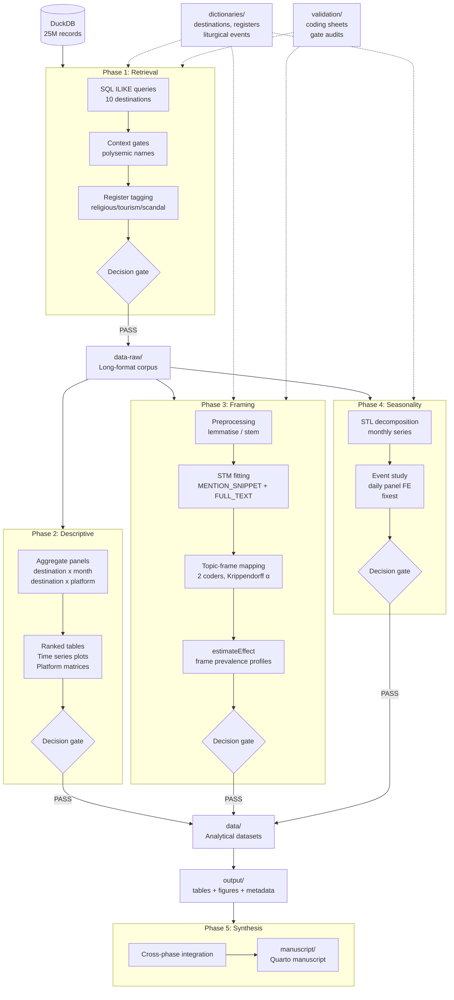

# Project Scaffold: Religious Tourism Media Analysis

## Folder Tree

```
Matea_Turizam/
│
├── .claude/                              # Agent infrastructure (project level)
│   ├── rules/                            # Always-on constraints for every session
│   │   ├── r-style.md                    # data.table idioms, naming, pipe avoidance
│   │   ├── croatian-nlp.md               # Diacritics, morphology, ILIKE patterns
│   │   ├── data-provenance.md            # Metadata snapshots, file naming, decision gates
│   │   └── manuscript-standards.md       # Journal formatting, citation, table/figure numbering
│   │
│   ├── contexts/                         # Work mode configurations
│   │   ├── retrieval.md                  # Phase 1: DB connection, query patterns, context gates
│   │   ├── analysis.md                   # Phases 2-4: STM, time series, event study
│   │   ├── writing.md                    # Phase 5: manuscript drafting and revision
│   │   └── review.md                     # QA: validation, inter-coder reliability, audits
│   │
│   ├── skills/                           # Project-specific repeatable workflows
│   │   ├── run-phase/                    # Execute any pipeline phase with decision gate
│   │   │   └── SKILL.md
│   │   ├── validate-stm/                 # STM diagnostics: exclusivity, coherence, held-out
│   │   │   └── SKILL.md
│   │   ├── build-event-window/           # Construct event study windows from liturgical calendar
│   │   │   └── SKILL.md
│   │   ├── write-section/                # Draft manuscript section in Croatian academic style
│   │   │   └── SKILL.md
│   │   └── update-metadata/              # Refresh metadata snapshot after any phase run
│   │       └── SKILL.md
│   │
│   └── CLAUDE.md                         # Project-level instructions: loads rules, points to contexts
│
├── R/                                    # Reusable function definitions
│   ├── connect_db.R                      # DuckDB connection wrapper
│   ├── build_query.R                     # Parameterised SQL builder with context gates
│   ├── tag_registers.R                   # Religious, tourism, scandal register tagging
│   ├── decision_gate.R                   # Generic PASS/FAIL/CAUTION gate framework
│   ├── metadata_snapshot.R               # Snapshot constructor and writer
│   ├── croatian_patterns.R               # Morphological pattern generator for destinations
│   └── theme_reltur.R                    # ggplot2 theme for publication figures
│
├── analysis/                             # Phase scripts (Quarto QMD)
│   ├── 01-retrieval/
│   │   ├── 01_retrieval.qmd              # Main retrieval script
│   │   └── 01_retrieval_config.rds       # Frozen config (generated on first run)
│   ├── 02-descriptive/
│   │   ├── 02_descriptive.qmd
│   │   └── 02_descriptive_config.rds
│   ├── 03-framing/
│   │   ├── 03a_preprocessing.qmd         # Corpus preparation, lemmatisation
│   │   ├── 03b_model_selection.qmd       # K sweep, diagnostics
│   │   ├── 03c_topic_frame_mapping.qmd   # Manual coding protocol, Krippendorff alpha
│   │   ├── 03d_effect_estimation.qmd     # estimateEffect, frame prevalence profiles
│   │   └── 03_framing_config.rds
│   ├── 04-seasonality/
│   │   ├── 04a_stl_decomposition.qmd     # Monthly STL via feasts
│   │   ├── 04b_event_study.qmd           # Daily panel FE regression via fixest
│   │   └── 04_seasonality_config.rds
│   └── 05-synthesis/
│       └── 05_synthesis.qmd              # Cross-phase integration, robustness summary
│
├── data-raw/                             # Phase 1 outputs: unprocessed retrieval results
│   └── .gitkeep
│
├── data/                                 # Analytical inputs: derived, cleaned, panel-ready
│   └── .gitkeep
│
├── dictionaries/                         # Shared terminology assets
│   ├── destinations.csv                  # Canonical destination list with types, coordinates
│   ├── destination_patterns.csv          # ILIKE patterns + context gates per destination
│   ├── registers.csv                     # Register keywords (religious, tourism, scandal)
│   ├── liturgical_events.csv             # Feast dates, event windows, destination associations
│   └── digikat_catholic_dictionary.csv   # Parent project terminology (~70 root terms)
│
├── validation/                           # Human review artefacts
│   ├── coding-sheets/                    # Blank templates for manual annotation
│   │   └── .gitkeep
│   ├── annotated/                        # Completed coding sheets (returned by coders)
│   │   └── .gitkeep
│   ├── context-gate-audit/               # Sampled articles for polysemic gate validation
│   │   └── .gitkeep
│   └── sentiment-validation/             # BERTic vs AUTO_SENTIMENT comparison samples
│       └── .gitkeep
│
├── manuscript/                           # Self-contained manuscript directory
│   ├── manuscript.qmd                    # Main Quarto manuscript
│   ├── _quarto.yml                       # Manuscript-specific Quarto project config
│   ├── references.bib                    # BibTeX bibliography
│   ├── citation-style.csl                # Target journal CSL
│   ├── figures/                          # Publication-ready figures (copied from output/)
│   │   └── .gitkeep
│   ├── tables/                           # Publication-ready tables (copied from output/)
│   │   └── .gitkeep
│   └── supplementary/                    # Online appendix, robustness tables, codebook
│       └── .gitkeep
│
├── output/                               # Machine-generated outputs from analysis phases
│   ├── tables/                           # gt/kableExtra publication tables
│   │   └── .gitkeep
│   ├── figures/                          # ggplot2/patchwork publication plots
│   │   └── .gitkeep
│   ├── reports/                          # Interim rendered Quarto HTML/PDF
│   │   └── .gitkeep
│   └── metadata/                         # Phase metadata snapshots (.rds)
│       └── .gitkeep
│
├── ref/                                  # Reference implementations and design docs
│   ├── research_design.md                # Full research design document (this brief)
│   └── hnb_reference/                    # Analogous HNB scripts for convention reference
│       └── .gitkeep
│
├── python/                               # Optional Python components
│   ├── bertic_sentiment.py               # BERTic sentiment scoring script
│   ├── classla_lemmatise.py              # Classla lemmatisation for STM preprocessing
│   └── requirements.txt                  # Python dependencies (separate from renv)
│
├── _targets.R                            # targets pipeline specification (optional, see rationale)
├── build.R                               # Simple script: rebuilds full pipeline raw-to-manuscript
├── renv.lock                             # Package lockfile (generated by renv::snapshot())
├── .Rprofile                             # renv activation
├── .gitignore                            # Excludes data, DuckDB, renv/library, rendered output
├── README.md                             # Project overview, setup, reproduction instructions
├── LICENSE                               # CC BY 4.0
└── CITATION.cff                          # Machine-readable citation metadata
```


## Rationale for Non-obvious Decisions

**Why `.claude/` lives inside the project, not at the global level.** Your global `.claude/skills/` already has general purpose skills (croatian-academic-style, research-feedback, paper-reviewer). Those apply across all your projects. The project level `.claude/` holds skills, rules, and contexts that are specific to this sub-study. When you open a session in this folder, both layers are available. The project level skills reference the analytical pipeline, the specific destinations, and the DuckDB schema. The global skills handle prose quality and review methodology. No collision, clean separation.

**Why CLAUDE.md at project root.** This is the file that Claude Code and Cowork read automatically when you open a session rooted in this directory. It points to the rules directory (which gets loaded into every session as ambient constraints) and lists the available contexts with one-line descriptions so you can say "load the retrieval context" without navigating the filesystem. Think of it as the project's handshake with the agent.

**Why `analysis/` is numbered directories rather than flat QMD files.** Phase 3 (framing) already needs four sub-scripts. Flat naming like `03a_preprocessing.qmd` works inside a directory but becomes chaotic at root level when multiplied across five phases. The numbered directory approach also gives each phase a natural home for its frozen config `.rds`, any phase-specific helper scripts, and rendered output that you might want to inspect without polluting the global `output/` directory.

**Why `manuscript/` is a self-contained Quarto project.** The manuscript must compile independently. A journal reviewer or co-author who receives this directory should be able to run `quarto render` without touching the analytical pipeline. Figures and tables are copied (not symlinked) from `output/` into `manuscript/figures/` and `manuscript/tables/`. This creates a small duplication cost but eliminates fragile cross-directory dependencies. The `_quarto.yml` inside `manuscript/` is independent of any project-level Quarto config.

**Why `ref/` for reference implementations.** Your HNB scripts establish conventions (section numbering, decision gates, config-from-disk pattern) that new phase scripts should follow. Putting them in `ref/hnb_reference/` makes them accessible without mixing them into the active analysis directory. They are documentation, not code that runs.

**Why `_targets.R` is optional.** The targets package gives you a dependency graph with caching and selective re-execution. For a five phase pipeline with hard disk boundaries between phases, it is genuinely useful. But your existing convention of QMD scripts with explicit disk I/O at phase boundaries already enforces the same separation. Adding targets introduces a learning curve and a second way of thinking about the pipeline. My recommendation: start without it, add it if you find yourself re-running phases unnecessarily during revision cycles. The `build.R` script handles the simple case of full rebuilds.

**Why `python/` is a sibling directory rather than embedded.** Python is optional and auxiliary. Keeping it separate with its own `requirements.txt` avoids confusion about which environment manages which dependency. R scripts that call Python components (via reticulate or system calls) reference `python/bertic_sentiment.py` explicitly.

**Why rules, contexts, and skills rather than a single instructions file.** A single CLAUDE.md could hold everything, but it would be a 2000-line document that loads into every session regardless of what you are doing. Rules are short (50-100 lines each) and always relevant. Contexts are loaded on demand and focus attention. Skills are invoked for specific tasks. This layered approach means a retrieval session loads ~200 lines of relevant instruction instead of ~2000 lines of everything.


## Pipeline Diagram




## Agent Infrastructure Detail

### Rules (always loaded, ~50-100 lines each)

**r-style.md** encodes your coding conventions. data.table syntax over dplyr. No magrittr pipe in data.table chains. stringi over base R for all text operations. Explicit seeding before every stochastic call. Config as a list, saved to disk as .rds. Function signatures: snake_case, first argument is always the data object.

**croatian-nlp.md** encodes text handling invariants. All regex via stringi with ICU rules. Named entity matching must cover at minimum nominative, genitive, accusative, and locative. Polysemic destinations always require a conjunctive context gate. Character encoding is always UTF-8, enforced at connection time. This rule prevents the single most common silent failure in Croatian text analysis.

**data-provenance.md** encodes the metadata and reproducibility contract. Every phase script ends with a metadata snapshot. File naming follows the pattern `{phase}_{descriptor}_{YYYYMMDD}.{ext}`. Decision gate results are stored in the metadata, not just printed. Raw data never gets overwritten; analytical datasets are versioned by date.

**manuscript-standards.md** encodes journal submission conventions. Table numbering is sequential across the manuscript. Figure format is PDF for vector, PNG at 300 DPI for raster. Croatian academic citation style follows the target journal's CSL. Abstract word limit, keyword count, and section ordering per journal guidelines.

### Contexts (loaded on demand, ~100-150 lines each)

**retrieval.md** tells the agent: read `dictionaries/destination_patterns.csv` first. Reference `R/connect_db.R` and `R/build_query.R`. The database path is `C:/Users/lsikic/Luka C/DetermDB/determDB.duckdb`, read-only. Every query must be logged. After retrieval, run decision gate checks for minimum article count per destination, zero-result detection, and duplicate article-destination pair detection.

**analysis.md** tells the agent: read from `data-raw/` or `data/`, never query the database directly. Load `R/theme_reltur.R` for all plots. STM models require explicit seed. fixest formulas use destination + month + dow fixed effects. All analytical output goes to `output/`. Metadata snapshot after every phase.

**writing.md** tells the agent: load the `croatian-academic-style` skill (global) and the `write-section` skill (project). Reference `manuscript/references.bib` for available citations. Check that every empirical claim in prose has a corresponding table or figure. Croatian prose, no bullet lists.

**review.md** tells the agent: read the target phase script and its metadata snapshot. Check internal consistency (does config match what the script actually does?). Verify decision gate pass conditions. For STM phases, run the `validate-stm` skill. For retrieval, sample 50 articles per polysemic destination and check context gate accuracy.

### Skills (invoked for specific tasks, ~200-400 lines each)

**run-phase** standardises the execution of any pipeline phase. Takes phase number as input. Reads the corresponding config, connects to data, executes, runs decision gate, writes metadata snapshot, prints summary. Follows the section numbering convention from HNB reference (0-11).

**validate-stm** runs STM diagnostic checks. Semantic coherence vs exclusivity plot. Held-out likelihood for K selection. Top words and FREX display for manual inspection. Comparison with FULL_TEXT robustness model. Produces a diagnostic report in `output/reports/`.

**build-event-window** constructs event study data from `dictionaries/liturgical_events.csv`. Takes window width as parameter. Produces a daily panel with pre/post indicators, destination and event identifiers, and day-of-week controls. Output goes to `data/` for Phase 4 consumption.

**write-section** drafts a manuscript section in Croatian academic style. Takes section identifier (e.g., "results-framing") and pulls relevant tables and figures from `output/`. Applies the `croatian-academic-style` global skill. Produces a QMD fragment that can be included in the main manuscript.

**update-metadata** refreshes the metadata snapshot for a given phase. Captures R version, package versions from renv, config contents, decision gate results, output file paths and checksums, and timestamp.


## Setup Checklist (first clone)

1. Install R 4.3+ and Quarto CLI
2. Clone the repository
3. Open R in the project root. `renv::restore()` installs all R dependencies from `renv.lock`
4. Verify DuckDB access: `source("R/connect_db.R"); con <- connect_db(); DBI::dbListTables(con); DBI::dbDisconnect(con)`
5. (Optional) Create a Python virtual environment: `cd python && python -m venv .venv && pip install -r requirements.txt`
6. (Optional) Install classla models: `python -c "import classla; classla.download('hr')"`
7. Run the full pipeline: `source("build.R")` or execute phase scripts sequentially
8. Compile manuscript: `cd manuscript && quarto render manuscript.qmd`
9. Verify agent infrastructure: open a Cowork or Claude Code session rooted in `Matea_Turizam/`, confirm that `CLAUDE.md` loads and project skills appear


## What Gets Built Now vs Later

This scaffold creates the directory structure and placeholder files immediately. The actual content of skills, rules, and contexts should be written iteratively as you begin each phase. Phase 1 retrieval is the natural starting point: write `retrieval.md` context and `r-style.md` rule when you begin the first query script. The patterns will crystallise from real work rather than from speculation about what conventions will matter.

The dictionaries (destinations.csv, destination_patterns.csv, registers.csv, liturgical_events.csv) should be populated before Phase 1 begins. These are the analytical inputs that every downstream phase depends on, and getting the morphological patterns right is a first-class concern that deserves dedicated attention.
